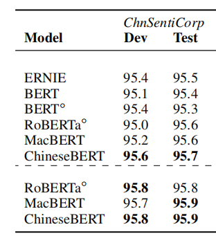
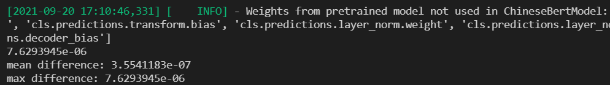
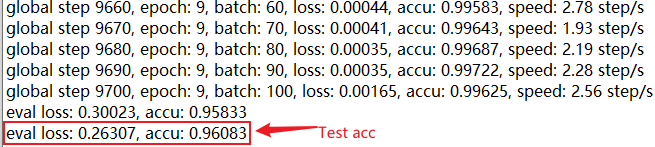
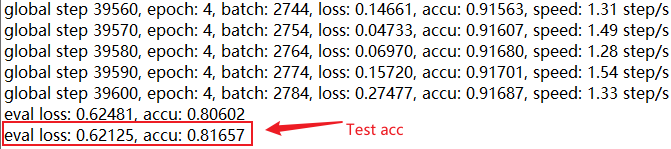
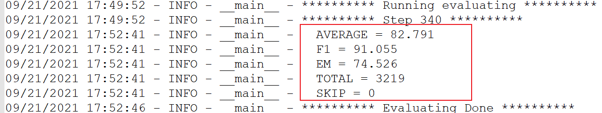

Use PaddlePaddle to reproduce the paper：**ChineseBERT**: Chinese Pretraining Enhanced by Glyph and Pinyin Information

English | [简体中文](./README_cn.md)

## ChineseBERT

[ChineseBERT: Chinese Pretraining Enhanced by Glyph and Pinyin Information](https://arxiv.org/pdf/2106.16038.pdf)


**Abstract：**
Recent Chinese pre-training models ignore two important aspects unique to Chinese: character shape and pinyin, which have important grammatical and semantic information for language understanding. In this research, we propose Chinese pre-training, which incorporates the glyph and pinyin information of Chinese characters into the language model pre-training. Glyph embedding is obtained based on different fonts of Chinese characters, which can capture the semantics of Chinese characters from visual features. Pinyin embedding represents the pronunciation of Chinese characters and handles the highly popular phenomenon of different meanings in Chinese (the same Chinese characters have different pronunciations and different meanings). After pre-training on a large-scale unlabeled Chinese corpus, the proposed ChineseBERT model produces a significant performance improvement on the baseline model with fewer training steps. The model achieves new SOTA performance on a wide range of Chinese natural language processing tasks, including competitive performance in machine reading comprehension, natural language inference, text classification, sentence pair matching, and named entity recognition.

This project is an open source implementation of ChineseBERT on Paddle 2.x.

## Original Paper Effect
<p align="center">
    
    
    
</p>


## Environment Installation

| label  | value     |
|--------|------------------|
| python | >=3.6     |
| GPU    | V100       |
| Frame    | PaddlePaddle2\.1.2 |
| Cuda   | 10.1         |
| Cudnn  | 7.6 |

Cloud platform used in this recurrence：https://aistudio.baidu.com/


```bash
# Clone the repository
git clone https://github.com/27182812/ChineseBERT_paddle
# Enter the root directory
cd ChineseBERT_paddle
# Install the necessary python libraries locally
pip install -r requirements.txt

```

## Quick Start

### （一）Model Accuracy Alignment
run `python compare.py`，Comparing the accuracy between huggingface and paddle, we can find that the average error of accuracy is on the order of 10^-7, and the maximum error is on the order of 10^-6.
```python
python compare.py
# ChineseBERT-large-pytorch vs paddle ChineseBERT-large-paddle
mean difference: 3.5541183e-07
max difference: 7.6293945e-06
# ChineseBERT-base-pytorch vs paddle ChineseBERT-base-paddle
mean difference: 2.1572937e-06
max difference: 4.3660402e-05

```




#### Pre-trained model weights-base

链接：https://pan.baidu.com/s/1FJDP1BR81ST6XWCMDQgsYw 
提取码：fk4i

#### Pre-trained model weights-large

链接：https://pan.baidu.com/s/1S9YRrYZdya1QEO9NiDomTQ 
提取码：b5qn


#### Model weight, dictionary and tokenizer_config path configuration instructions

##### Pre-training weights

将[modeling.py](pdchinesebert/modeling.py)中第81行ChineseBERT-large对应的路径改为权重实际的路径

##### Dictionary path

将[tokenizer.py](pdchinesebert/tokenizer.py)中第10行ChineseBERT-large对应的字典路径改为vocab.txt实际所在的路径

##### Tokenizer_config path

将[tokenizer.py](pdchinesebert/tokenizer.py)中第14行ChineseBERT-large对应的路径改为tokenizer_config.json实际所在路径


### （二）Downstream task fine-tuning

#### 1、ChnSentiCorp
Take the ChnSentiCorp dataset as an example.

#### （1）Model fine-tuning：
```shell
# run train
python train_chn.py \
--data_path './data/ChnSentiCorp' \
--device 'gpu' \
--epochs 10 \
--max_seq_length 512 \
--batch_size 8 \
--learning_rate 2e-5 \
--weight_decay 0.0001 \
--warmup_proportion 0.1 \
--seed 2333 \
--save_dir 'outputs/chn' | tee outputs/train_chn.log
```
**Model Link**

link：https://pan.baidu.com/s/1DKfcUuPxc7Kymk__UXHvMw 
password：85rl

#### (2) Evaluate

The acc on the dev and test datasets are respectively 95.8 and 96.08, which meet the accuracy requirements of the paper. The results are as follows:

<p>
  
</p>

#### 2、XNLI

#### （1）Train

```bash
python train_xnli.py \
--data_path './data/XNLI' \
--device 'gpu' \
--epochs 5 \
--max_seq_len 256 \
--batch_size 16 \
--learning_rate 1.3e-5 \
--weight_decay 0.001 \
--warmup_proportion 0.1 \
--seed 2333 \
--save_dir outputs/xnli | tee outputs/train_xnli.log
```

#### （2）Evaluate

The best result of the test dataset acc is 81.657, which meets the accuracy requirements of the paper. The results are as follows:



**Model Link**

link：https://pan.baidu.com/s/1lZ2T31FlZecKSOEHwExbrQ 
password：oskm

#### 3、cmrc2018

#### (1) Train

```shell
# Start train
python train_cmrc2018.py \
    --model_type chinesebert \
    --data_dir "data/cmrc2018" \
    --model_name_or_path ChineseBERT-large \
    --max_seq_length 512 \
    --train_batch_size 8 \
    --gradient_accumulation_steps 8 \
    --eval_batch_size 16 \
    --learning_rate 4e-5 \
    --max_grad_norm 1.0 \
    --num_train_epochs 3 \
    --logging_steps 2 \
    --save_steps 20 \
    --warmup_radio 0.1 \
    --weight_decay 0.01 \
    --output_dir outputs/cmrc2018 \
    --seed 1111 \
    --num_workers 0 \
    --use_amp
```

During the training process, the model will be evaluated on the dev dataset, and the best results are as follows:

```python

{
    AVERAGE = 82.791
    F1 = 91.055
    EM = 74.526
    TOTAL = 3219
    SKIP = 0
}

```




#### （2）Run eval.py to generate the test data set to predict the answer

```bash
python eval.py --model_name_or_path outputs/step-340 --n_best_size 35 --max_answer_length 65
```

Among them, model_name_or_path is the model path

#### （3）Submit to CLUE

The test dataset EM is 78.55, which meets the accuracy requirements of the paper. The results are as follows:

<p align="center">
 
</p>

**Model Link**

link：https://pan.baidu.com/s/11XSY3PPB_iWNBVme6JmqAQ 
password：17yw


### Train Log

Training logs  can be find [HERE](logs)


# Reference

```bibtex
@article{sun2021chinesebert,
  title={ChineseBERT: Chinese Pretraining Enhanced by Glyph and Pinyin Information},
  author={Sun, Zijun and Li, Xiaoya and Sun, Xiaofei and Meng, Yuxian and Ao, Xiang and He, Qing and Wu, Fei and Li, Jiwei},
  journal={arXiv preprint arXiv:2106.16038},
  year={2021}
}

```
