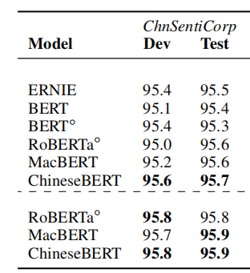
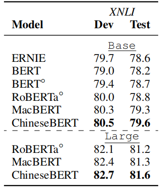
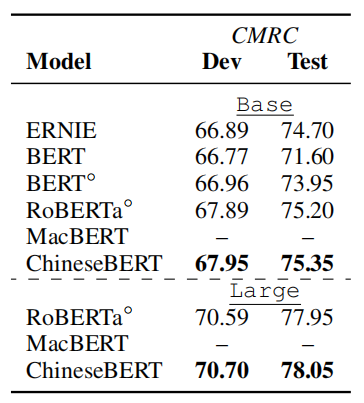
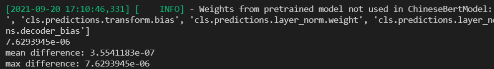
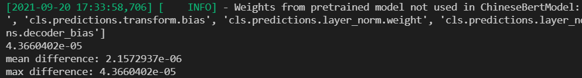
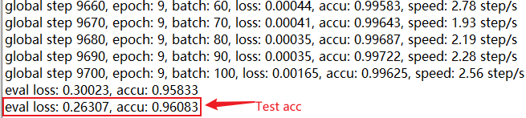
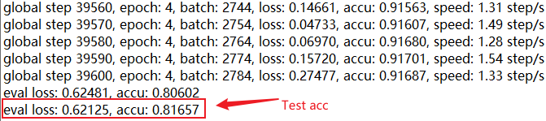
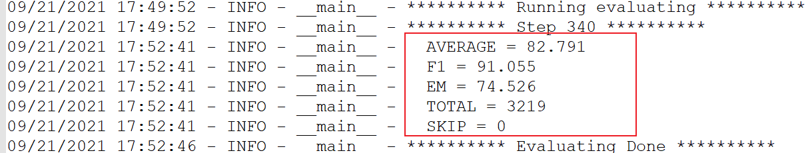
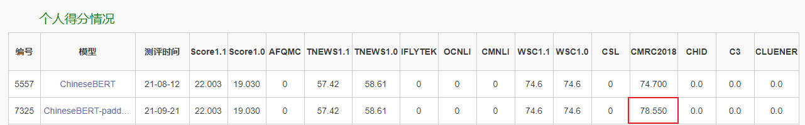

使用PaddlePaddle复现论文：**ChineseBERT**: Chinese Pretraining Enhanced by Glyph and Pinyin Information


[English](./README.md) | 简体中文

## ChineseBERT

[ChineseBERT: Chinese Pretraining Enhanced by Glyph and Pinyin Information](https://arxiv.org/pdf/2106.16038.pdf)


**摘要：**
最近的汉语预训练模型忽略了汉语特有的两个重要方面：字形和拼音，它们对语言理解具有重要的语法和语义信息。在本研究中，我们提出了汉语预训练，它将汉字的字形和拼音信息纳入语言模型预训练中。字形嵌入是基于汉字的不同字体获得的，能够从视觉特征中捕捉汉字语义，拼音嵌入代表汉字的发音，处理汉语中高度流行的异义现象（同一汉字具有不同的发音和不同的含义）。在大规模的未标记中文语料库上进行预训练后，所提出的ChineseBERT模型在训练步骤较少的基线模型上产生了显著的性能提高。该模型在广泛的中国自然语言处理任务上实现了新的SOTA性能，包括机器阅读理解、自然语言推理、文本分类、句子对匹配和命名实体识别方面的竞争性能

本项目是 ChineseBERT在 Paddle 2.x上的开源实现。

## 原论文效果
<p align="center">
    
    
    
</p>


## 环境安装

| 名称   | 值             |
|--------|------------------|
| python | >=3.6     |
| GPU    | V100       |
| 框架    | PaddlePaddle2\.1.2 |
| Cuda   | 10.1         |
| Cudnn  | 7.6 |

本次复现使用的云平台：https://aistudio.baidu.com/


```bash
# 克隆本仓库
git clone https://github.com/27182812/ChineseBERT_paddle
# 进入根目录
cd ChineseBERT_paddle
# 本地安装必要的python库
pip install -r requirements.txt

```

## 快速开始

### （一）模型精度对齐
运行`python compare.py`，对比huggingface与paddle之间的精度，我们可以发现精度的平均误差在10^-7量级，最大误差在10^-6量级。
```python
python compare.py
# ChineseBERT-large-pytorch vs paddle ChineseBERT-large-paddle
mean difference: 3.5541183e-07
max difference: 7.6293945e-06
# ChineseBERT-base-pytorch vs paddle ChineseBERT-base-paddle
mean difference: 2.1572937e-06
max difference: 4.3660402e-05

```




#### 预训练模型权重-base

链接：https://pan.baidu.com/s/1FJDP1BR81ST6XWCMDQgsYw 
提取码：fk4i

#### 预训练模型权重-large

链接：https://pan.baidu.com/s/1S9YRrYZdya1QEO9NiDomTQ 
提取码：b5qn


#### 模型权重、字典以及tokenizer_config路径配置说明

##### 预训练权重

将[modeling.py](pdchinesebert/modeling.py)中第81行ChineseBERT-large对应的路径改为权重实际的路径

##### 字典路径

将[tokenizer.py](pdchinesebert/tokenizer.py)中第10行ChineseBERT-large对应的字典路径改为vocab.txt实际所在的路径

##### tokenizer_config路径

将[tokenizer.py](pdchinesebert/tokenizer.py)中第14行ChineseBERT-large对应的路径改为tokenizer_config.json实际所在路径


### （二）下游任务微调

#### 1、ChnSentiCorp
以ChnSentiCorp数据集为例

#### （1）模型微调：
```shell
# 运行训练
python train_chn.py \
--data_path './data/ChnSentiCorp' \
--device 'gpu' \
--epochs 10 \
--max_seq_length 512 \
--batch_size 8 \
--learning_rate 2e-5 \
--weight_decay 0.0001 \
--warmup_proportion 0.1 \
--seed 2333 \
--save_dir 'outputs/chn' | tee outputs/train_chn.log
```
**模型链接**

链接：https://pan.baidu.com/s/1DKfcUuPxc7Kymk__UXHvMw 
提取码：85rl

#### (2) 评估

在dev和test数据集上acc分别为95.8和96.08，达到论文精度要求，结果如下

<p>
  
</p>

#### 2、XNLI

#### （1）训练

```bash
python train_xnli.py \
--data_path './data/XNLI' \
--device 'gpu' \
--epochs 5 \
--max_seq_len 256 \
--batch_size 16 \
--learning_rate 1.3e-5 \
--weight_decay 0.001 \
--warmup_proportion 0.1 \
--seed 2333 \
--save_dir outputs/xnli | tee outputs/train_xnli.log
```

#### （2）评估

test数据集 acc最好结果为81.657,达到论文精度要求，结果如下



**模型链接**

链接：https://pan.baidu.com/s/1lZ2T31FlZecKSOEHwExbrQ 
提取码：oskm

#### 3、cmrc2018

#### (1) 训练

```shell
# 开始训练
python train_cmrc2018.py \
    --model_type chinesebert \
    --data_dir "data/cmrc2018" \
    --model_name_or_path ChineseBERT-large \
    --max_seq_length 512 \
    --train_batch_size 8 \
    --gradient_accumulation_steps 8 \
    --eval_batch_size 16 \
    --learning_rate 4e-5 \
    --max_grad_norm 1.0 \
    --num_train_epochs 3 \
    --logging_steps 2 \
    --save_steps 20 \
    --warmup_radio 0.1 \
    --weight_decay 0.01 \
    --output_dir outputs/cmrc2018 \
    --seed 1111 \
    --num_workers 0 \
    --use_amp
```

训练过程中模型会在dev数据集进行评估，其中最好的结果如下所示：

```python

{
    AVERAGE = 82.791
    F1 = 91.055
    EM = 74.526
    TOTAL = 3219
    SKIP = 0
}

```




#### （2）运行eval.py，生成test数据集预测答案

```bash
python eval.py --model_name_or_path outputs/step-340 --n_best_size 35 --max_answer_length 65
```

其中，model_name_or_path为模型路径

#### （3）提交CLUE

test数据集 EM为78.55，达到论文精度要求，结果如下：

<p align="center">
 
</p>

**模型链接**

链接：https://pan.baidu.com/s/11XSY3PPB_iWNBVme6JmqAQ 
提取码：17yw


### 训练日志

Training logs  can be find [HERE](logs)


# Reference

```bibtex
@article{sun2021chinesebert,
  title={ChineseBERT: Chinese Pretraining Enhanced by Glyph and Pinyin Information},
  author={Sun, Zijun and Li, Xiaoya and Sun, Xiaofei and Meng, Yuxian and Ao, Xiang and He, Qing and Wu, Fei and Li, Jiwei},
  journal={arXiv preprint arXiv:2106.16038},
  year={2021}
}

```
